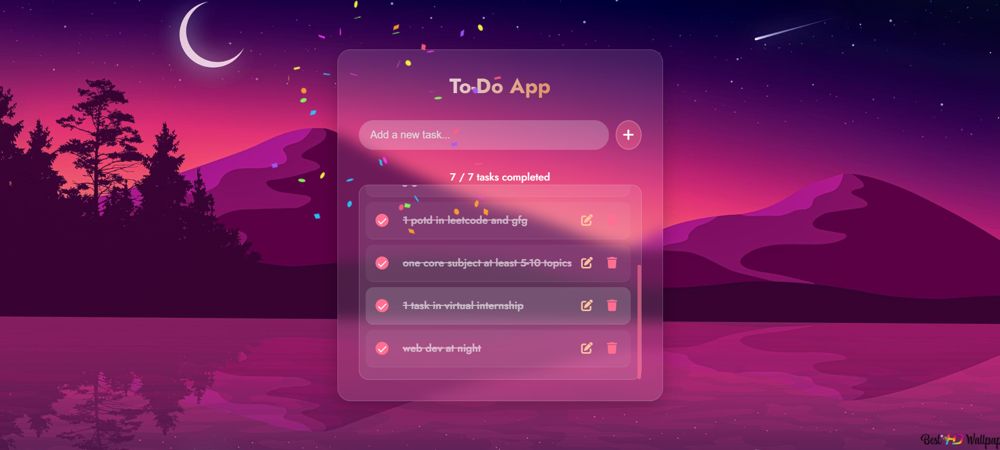

# ✅ TidyTask – Simple To-Do List App

TidyTask is a minimalist and user-friendly to-do list web application that helps users manage their daily tasks efficiently. With a clean interface and smooth functionality, users can easily add, complete, and delete tasks to stay organized.

🔗 **Live Demo:** [tidyytask.netlify.app](https://tidyytask.netlify.app/)

---

## 📌 Features

- 📝 Add new tasks
- ✅ Mark tasks as completed
- 🎉 Celebration effect when all tasks are completed!
- ❌ Delete tasks from the list
- 📱 Fully responsive design
- ⚡ Instant updates without page reload

---

## 🚀 Tech Stack

- HTML
- CSS
- JavaScript (Vanilla)

---

## 📸 Screenshot




---

## 🛠️ Run Locally

Clone the project:

```bash
git clone https://github.com/YOUR-USERNAME/tidy-task.git
cd tidy-task

## 📄 License

This project is licensed under the **MIT License**.  
You are free to use, modify, and distribute this project for personal or commercial purposes — just give proper credit.

See the full license in the [LICENSE](LICENSE) file.

---

© 2025 Shubh Gupta  
This project is licensed under the MIT License – see the [LICENSE](LICENSE) file for details.

